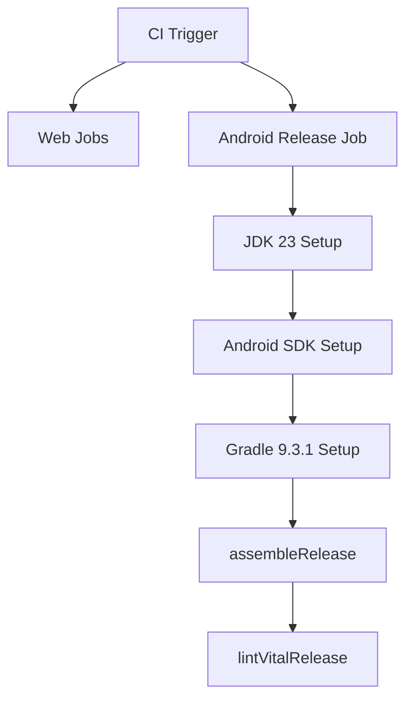

# Android CI Release Lint Enforcement Design

This design adds an Android CI gate that validates release assembly and release lint behavior on a supported JVM.

## Problem
Current CI validates web code only. Android release regressions can pass CI unnoticed.

## Constraint
AGP 8.6.1 lint in this repository crashes on JVM 24+ in local testing. We need release lint to run on a supported JVM in automation.

## Decision
Add a dedicated CI job in `.github/workflows/ci.yml`:
- `runs-on: ubuntu-latest`
- setup JDK 23 via `actions/setup-java`
- setup Android SDK via `android-actions/setup-android`
- setup Gradle via `gradle/actions/setup-gradle` pinned to 9.3.1
- execute in `native/android`:
  - `gradle :app:assembleRelease`
  - `gradle :app:lintVitalRelease`

## Workflow

## Tradeoff
- Pros:
  - Release and lint regressions are caught before merge.
  - Keeps lint active in CI using known-compatible JVM.
- Cons:
  - Longer CI runtime.
  - Requires maintenance if Android toolchain versions change.

## Follow-up
When AGP/lint is upgraded to fully support JVM 24+, reevaluate whether JDK pinning can be relaxed.
