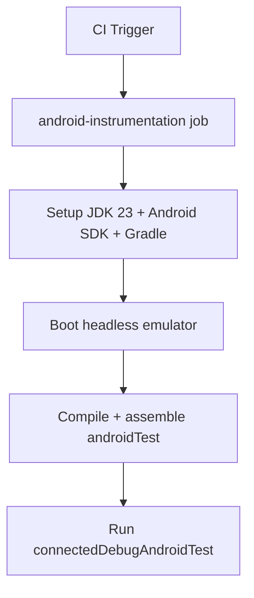

# Android Instrumentation CI Gate Design

This design adds a connected Android instrumentation gate to CI using a managed emulator.

## Problem
The repository includes substantial instrumentation coverage under `native/android/app/src/androidTest`, but CI currently does not run those tests.

## Decision
Add a new workflow job `android-instrumentation` in `.github/workflows/ci.yml`.

### Runtime Configuration
- Runner: `ubuntu-latest`
- Java: Temurin JDK 23
- Android SDK: installed via `android-actions/setup-android`
- Gradle: `9.3.1`
- Emulator runner: `reactivecircus/android-emulator-runner@v2`
  - API level: 34
  - target: `google_apis`
  - arch: `x86_64`
  - profile: `pixel_7`
  - headless flags for CI stability

### Test Command
Inside `native/android`:
- `gradle :app:compileDebugAndroidTestKotlin :app:assembleDebugAndroidTest :app:connectedDebugAndroidTest`

## Tradeoffs
- Pros:
  - Captures Compose/Espresso regressions in PR CI.
  - Uses the same command path exercised locally.
- Cons:
  - Increases CI runtime and emulator flake risk.

## Mitigations
- Use headless emulator options and disabled animations.
- Keep instrumentation job isolated from web and release jobs for easier reruns.
