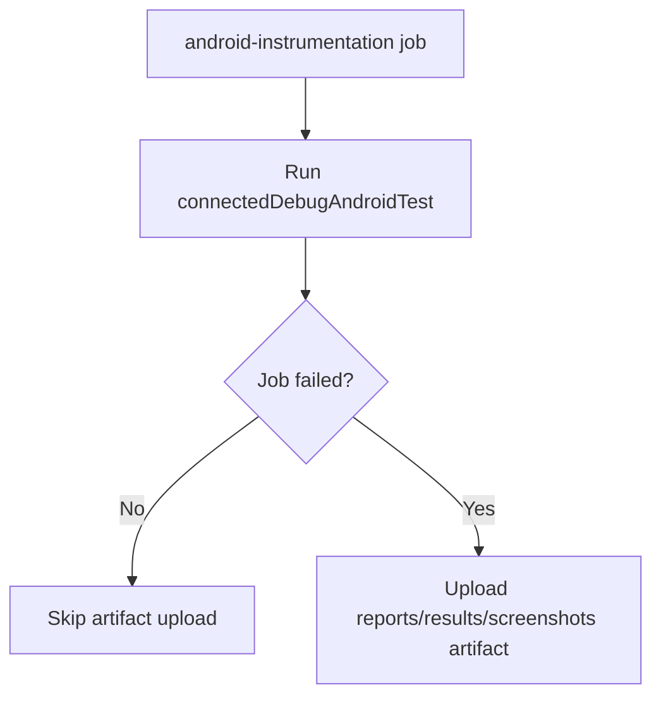

# Android Instrumentation Failure Artifact Upload Design

This design adds failure-only artifact upload for Android instrumentation CI.

## Problem
When emulator instrumentation fails in CI, logs and Android test outputs are not persisted, slowing triage.

## Decision
Add a failure-conditional artifact upload step to the `android-instrumentation` job in `.github/workflows/ci.yml`.

### Trigger Policy
- Upload step runs only when prior steps fail:
  - `if: failure()`

### Artifact Content
Upload likely diagnostics generated by Android connected tests:
- `native/android/app/build/reports/androidTests/connected/**`
- `native/android/app/build/outputs/androidTest-results/connected/**`
- `native/android/app/build/outputs/connected_android_test_additional_output/**`

Use `if-no-files-found: warn` so missing optional paths do not mask the root failure.

## Tradeoffs
- Pros:
  - Faster root-cause analysis for flaky/failed emulator tests.
  - No extra artifact overhead on passing runs.
- Cons:
  - Slightly larger failed-job storage usage.

## Follow-up
If needed later, add retention tuning and split artifacts by module/test class for large suites.
