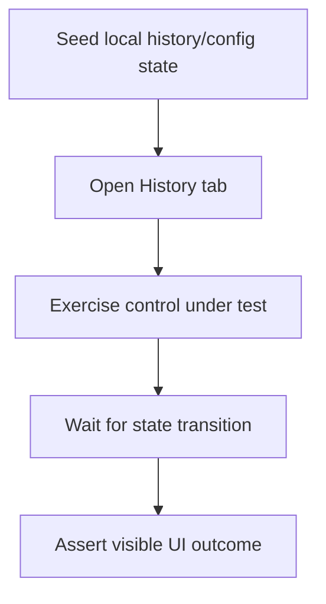

# Android Instrumentation UI Expansion Design

This design specifies additional Android instrumentation tests for the native history tab.

## Coverage Targets
- History delete removes the entry and returns empty-state UI.
- Include-expired switch reveals expired entries previously hidden by default.
- Cloud-sync setup section displays create/select Drive controls when sync file is not configured.

## Testability Strategy
- Introduce a stable `testTag` for include-expired switch:
  - `history-include-expired-switch`
- Keep assertions text-based for user-visible controls and states.
- Seed and clear local SharedPreferences state per test for deterministic behavior.

## State Seeding
- History entries are seeded through `SharedPreferencesHistoryStore`.
- Cloud-sync configuration state is reset via `secure_pastebin_cloud_sync_v1` shared preferences.

## Diagram

## Constraints
- Tests avoid external intent flows (Drive picker/share sheet) to keep instrumentation deterministic.
- Connected device/emulator is required for runtime execution.
