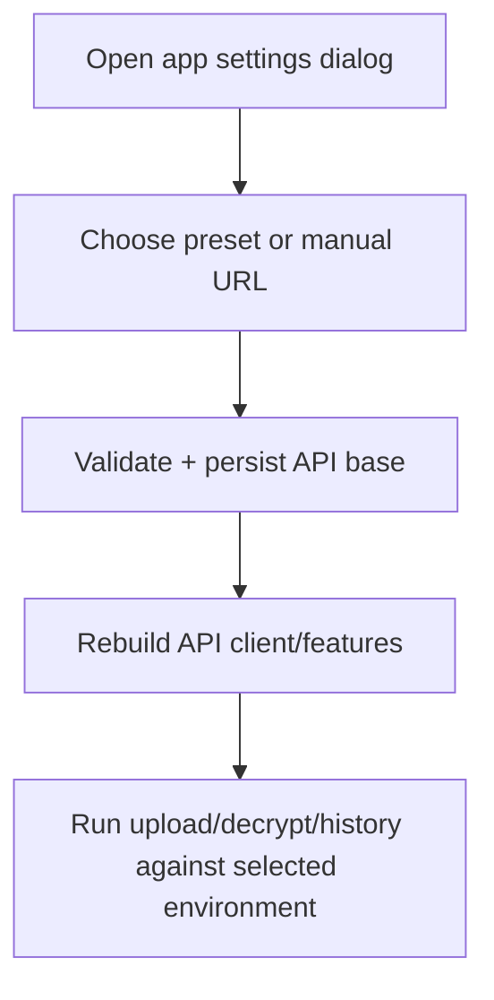

# Android Picker Edge + Runtime API Settings Design

This design extends Android native coverage and usability for real-device execution.

## Picker Edge Instrumentation

### Cancel path
- Intercept `ACTION_CREATE_DOCUMENT` with canceled result.
- Trigger `Create Drive File` from History cloud-sync section.
- Assert UI remains unconfigured and no setup error is displayed.

### Invalid-authority paths
- Intercept picker result with `content://` URI whose authority is not Google Drive.
- Validate user-facing setup errors:
  - `Create Drive File`: "Select a Google Drive location for cloud sync."
  - `Use Existing File`: "Select a JSON document from Google Drive."

## Runtime API Settings

### Data model
- Add persisted API base URL store in app preferences.
- Add preset catalog:
  - Local (`http://10.0.2.2:3000`)
  - Staging (`https://staging.pastebin.sed.fyi`)
  - Production (`https://pastebin.sed.fyi`)

### UI behavior
- Add app-shell Settings action and dialog.
- Dialog supports one-tap preset selection and manual URL edit.
- Apply validates URL and persists on success.
- Active API base is shown in shell and used to rebuild API-dependent features.

## Determinism and Safety
- Picker tests use Espresso Intents stubs, not external picker apps.
- API URL validation requires `http` or `https` with host present.
- Existing sync and history behavior remains unchanged beyond chosen API base.

## Flow

