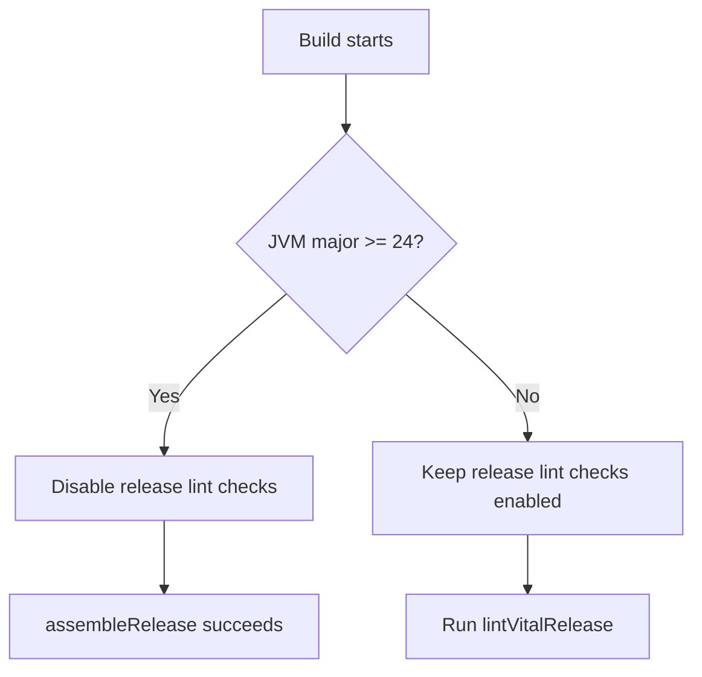

# Android Release Lint-Vital JVM Compatibility Design

This document describes the Gradle/JVM compatibility failure affecting Android release lint-vital tasks and the selected mitigation.

## Problem
Running `gradle :app:assembleRelease` on JVM 25 fails in `lintVitalAnalyzeRelease` across Android modules with:
- `IllegalArgumentException: 25.0.2`
- `A failure occurred while executing ... AndroidLintWorkAction`

The exception occurs in lint FIR/UAST initialization, not from actual lint findings.

## Root Cause
AGP `8.6.1` lint task execution is not stable on JVM 24+ in this environment.
On JVM 25, lint crashes before analysis completes.

## Decision
Apply a centralized Gradle guard in `native/android/build.gradle.kts`:
- Compute current JVM major version once.
- For Android application/library modules, set:
  - `lint.checkReleaseBuilds = false` only when JVM major is `>= 24`.
  - `lint.checkReleaseBuilds = true` on supported JVMs.

This keeps release builds unblocked in modern JVM environments while preserving lint-vital enforcement where stable.

## Tradeoff
- Pros:
  - Removes need for manual `-x lintVital*` task exclusions.
  - Keeps supported-JVM lint coverage.
- Cons:
  - Release lint checks are skipped when running on JVM 24+ until AGP/toolchain upgrade resolves compatibility.

## Follow-up
- Upgrade AGP/Android lint stack when a JVM 24+/25-compatible release is confirmed.
- Remove JVM gate after verifying stable lint-vital execution on upgraded toolchain.
