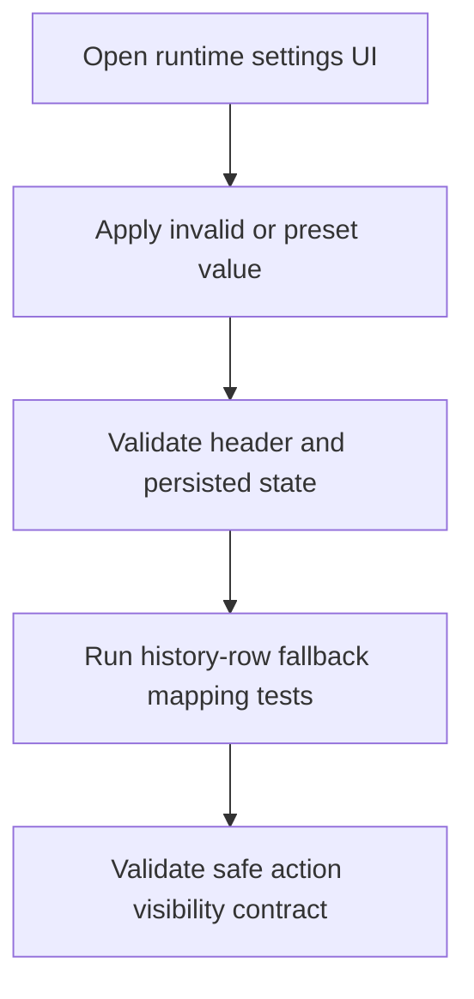

# Android Settings UI + Apple History Row Fallback Coverage Design

This design closes two remaining test gaps: Android runtime settings UI and Apple history row fallback behavior.

## Android Runtime API Settings UI Coverage

### Case A: Invalid manual URL
- Open app-level `Settings` dialog.
- Enter invalid API base URL.
- Tap `Apply`.
- Assert validation error message is shown and header API base remains unchanged.

### Case B: Preset apply + persistence
- Open settings dialog.
- Tap `Staging` preset.
- Tap `Apply`.
- Assert header displays staging API base.
- Recreate activity.
- Assert header still displays staging API base and stored preference key value remains staging URL.

## Apple History Row Action Fallback Coverage

### Goal
When a history item has no `shareURL`, UI should degrade safely:
- `Open` and `Share` actions hidden
- `Delete` action still available

### Approach
- Extract row-action visibility mapping to a small presentation helper in `FeatureHistory`.
- Keep `HistoryFlowView` rendering driven by the helper.
- Add unit tests for helper mapping with `shareURL == nil` and `shareURL != nil`.

## Determinism
- Android tests avoid network dependencies and only assert local UI/persistence behavior.
- Apple tests validate deterministic mapping output without depending on rendering internals.

## Flow

