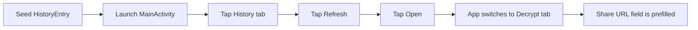

# Android UI Instrumentation Coverage Design

This document describes the instrumentation test design for Android Compose UI handoff from History to Decrypt.

## Behavior Under Test
- Given a persisted history entry, when a user taps `Open` from the History tab, the app must:
  - switch to Decrypt tab
  - prefill Decrypt `Share URL` field with generated `/p/{id}` URL

## Test Data Strategy
- Use `SharedPreferencesHistoryStore` directly from instrumentation setup.
- Insert one unexpired entry so the History list reliably renders an `Open` action.
- Clear store before/after each test to avoid cross-test contamination.

## UI Assertion Strategy
- Use `createAndroidComposeRule<MainActivity>()`.
- Drive UI with visible labels (`History`, `Refresh`, `Open`).
- Assert Decrypt state with:
  - presence of `Download and Decrypt` action
  - presence of `Share URL` field label
  - visible prefilled share URL value

## Diagram

## Limitations
- Runtime instrumentation execution requires a connected emulator/device.
- CI/local environments without a device can still validate compile/package of `androidTest` artifacts.
