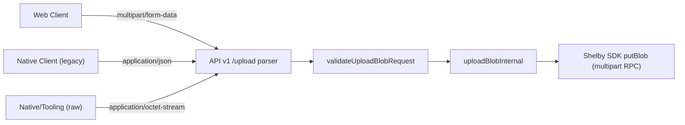

# API v1 Multipart Upload Hardening Design

## Purpose
Define a backward-compatible upload transport design that supports efficient multipart uploads while preserving existing JSON upload clients.

## Current State
- Backend endpoint `POST /api/v1/upload` accepts only JSON payloads shaped like:
  - `{ data: number[], filename: string }`
- Web client sends encrypted bytes as JSON number arrays.
- Shelby SDK upload (`putBlob`) already uses multipart RPC internally.

## Problems
1. JSON byte-array uploads inflate request size and memory pressure.
2. API path does not accept multipart form uploads from clients.
3. No explicit unsupported media type behavior for upload transport mismatch.

## Proposed Design

### Upload Content-Type Support
- `application/json`:
  - Existing behavior retained.
- `multipart/form-data`:
  - Accept `file` or `data` (binary form part).
  - Accept optional `filename` form field.
  - If `filename` missing, fall back to form file part name.
- `application/octet-stream`:
  - Raw request body bytes.
  - `filename` provided by query param (`?filename=`) or `X-Filename` header.

All paths normalize into `UploadBlobRequest` and run through existing `validateUploadBlobRequest(...)`.

### Error Mapping
- Unsupported content types return 415 (`Unsupported media type`).
- Existing 400/429/503 mappings remain unchanged.

### Web Client Upload Transport
- Switch to `multipart/form-data` for `/api/v1/upload`.
- Keep shared observability headers.
- Do not set `Content-Type` manually; allow browser boundary handling.

## Data Flow

## Compatibility
- Backward compatible for existing JSON clients.
- Additive contract change only; no response schema breakage.

## Compression Guidance
- Do not compress encrypted payload bytes: low/negative gain.
- If needed later, evaluate optional pre-encryption compression for text-heavy payloads behind a feature flag and minimum gain threshold.
