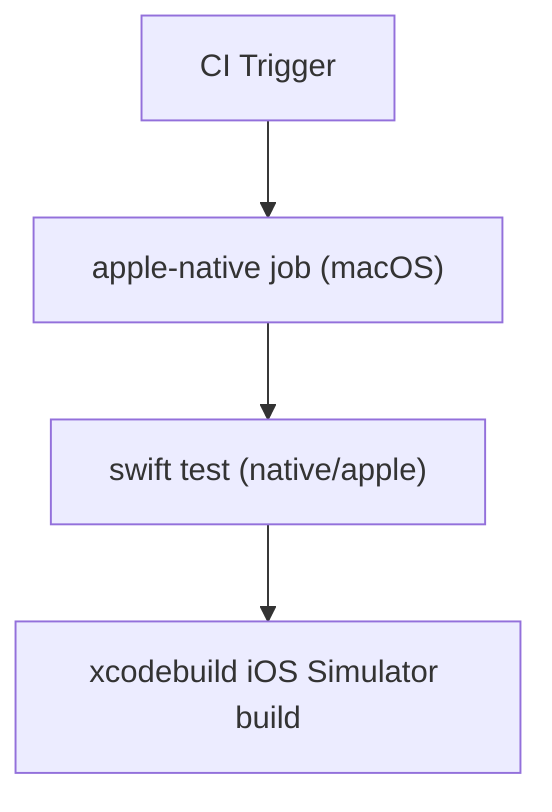

# Apple Native CI Gate Design

This design adds CI parity for native Apple validation.

## Problem
Current CI includes web and Android gates but no Apple native gate. Regressions in Swift packages or iOS app build can pass CI unnoticed.

## Decision
Add a new `apple-native` job in `.github/workflows/ci.yml`.

### Runtime
- Runner: `macos-latest`
- Commands executed from repository root with explicit `working-directory` on native steps.

### Checks
1. Swift package tests:
   - `swift test` in `native/apple`
2. iOS simulator app build:
   - `xcodebuild -project native/apple/SecurePastebinAppleDemo.xcodeproj -scheme SecurePastebinDemoApp -configuration Debug -destination 'generic/platform=iOS Simulator' build`

## Tradeoffs
- Pros:
  - Prevents Apple-native regressions from merging.
  - Matches existing local validation path.
- Cons:
  - macOS runners are slower/costlier than Linux runners.

## Follow-up
If runtime becomes too high, split Apple checks into fast (swift test) and full (xcodebuild) jobs with optional matrix/trigger tuning.
