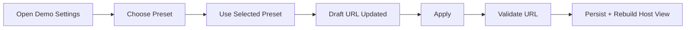

# Apple Demo Environment Presets Design

This design adds runtime environment presets to the Apple demo settings UI.

## Behavior
- Settings sheet shows a segmented preset picker: `Local`, `Staging`, `Production`.
- Selecting preset and pressing “Use Selected Preset” updates the URL draft field.
- User can still edit URL manually before applying.
- Apply continues to validate URL (scheme + host required).

## State Model
- `selectedEnvironmentPreset`: enum (`local`, `staging`, `production`).
- `draftAPIBaseURLString`: existing editable URL string.
- Validation state remains unchanged.

## UX Rules
- Preset does not auto-apply globally; it only updates draft field.
- Global app config changes only when user taps “Apply”.
- If current URL doesn’t match a preset, default picker selection remains `Local` and manual editing still works.

## Diagram

