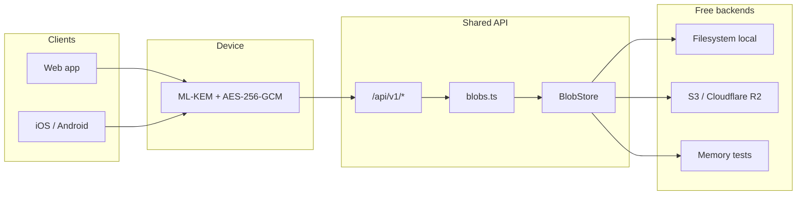

# Free Blob Storage Backend

## Purpose

Replace the Shelby Protocol / Aptos storage backend with a free object-storage backend while keeping client-side post-quantum encryption, share-link format, and the `/api/v1` contract used by web and native apps.

## Problem

Shelby storage required:

- `SHELBY_API_KEY` and `SHELBY_PRIVATE_KEY`
- Aptos `SHELBYNET` transactions for blob registration
- `@shelby-protocol/sdk` plus `clay.wasm` bundling

That stack is not a free, zero-friction backend. Encryption never needed it: the server already stores opaque ciphertext.

## Non-goals

- Do not change ML-KEM + AES-256-GCM + Argon2id client encryption.
- Do not change `/api/v1/upload`, `/api/v1/download`, `/api/v1/health`, or `/api/v1/capabilities` shapes.
- Do not send storage credentials or ciphertext keys to the browser.
- Do not migrate existing Shelby object IDs. Old Shelby-hosted pastes become unreachable after cutover.

## Options considered

1. **Public anonymous hosts** (`0x0.st`, `paste.rs`): no account, but no SLA, hostile ToS for an app, size/retention surprises.
2. **Vercel Blob only**: easy on Vercel Hobby, smaller free tier, public blob URLs, vendor lock-in.
3. **S3-compatible object storage + local filesystem** (chosen): Cloudflare R2 has a real free tier (10 GB, no egress). The same adapter works with Backblaze B2 and MinIO. Filesystem is the zero-config local default.

## Architecture



The browser and native apps still encrypt before upload. The API still accepts JSON, multipart, and octet-stream. Only the persistence adapter changes.

## Storage interface

`src/server/storage.ts` exposes a `BlobStore`:

- `put(id, bytes, meta)` — persist ciphertext and expiration metadata
- `get(id)` — return bytes or `null` (missing or expired)
- `delete(id)` — best-effort removal
- `kind` / `account` — health reporting (`memory`, `filesystem:<dir>`, `s3:<bucket>`)

Adapters:

| Kind | When | Persistence |
| --- | --- | --- |
| `memory` | tests, or `BLOB_STORE=memory` | process lifetime |
| `filesystem` | local default | `.data/blobs` (or `/tmp/secupaste-blobs` on Vercel if misconfigured) |
| `s3` | `BLOB_STORE=s3` or S3 env vars present | Cloudflare R2 / B2 / MinIO / AWS |

Auto-select order: explicit `BLOB_STORE` → S3 credentials → `memory` in test → filesystem.

## Encryption boundary

Unchanged:

- Password and ML-KEM private material stay on the device / URL fragment (`#k2....`)
- Server never decrypts
- Rate limits, filename sanitization, 100 MB cap, and `pastebin-<timestamp>-<name>-<suffix>` IDs stay

Expiration is enforced on read (delete + treat as missing). Default remains `DEFAULT_EXPIRATION_DAYS=30`.

## Production setup (free)

Recommended: Cloudflare R2.

```
BLOB_STORE=s3
S3_BUCKET=secupaste
S3_ENDPOINT=https://<accountid>.r2.cloudflarestorage.com
S3_REGION=auto
S3_ACCESS_KEY_ID=...
S3_SECRET_ACCESS_KEY=...
S3_FORCE_PATH_STYLE=true
```

Local development needs no cloud credentials.

## Health contract

`GET /api/v1/health` still returns `{ configured, account }`.

- `configured: true` when a store can be constructed
- `account` is a non-secret label such as `s3:secupaste` (no longer an Aptos address)

Native clients already treat this payload as opaque flags.

## Removed

- `@shelby-protocol/sdk`, `@aptos-labs/ts-sdk`, `copyClayWasmPlugin`
- `SHELBY_API_KEY` / `SHELBY_PRIVATE_KEY`
- CSP and preconnect entries for `*.shelby.xyz`
