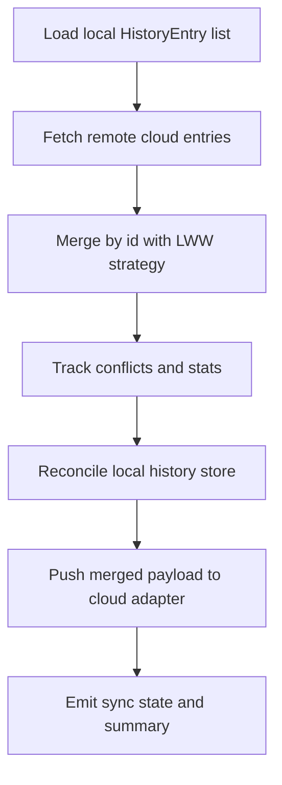

# Native Cloud Sync v1 Design

This design defines platform-native cloud sync adapters for history metadata with conflict-state reporting.

## Objectives
- Keep sync implementation native-first (Swift on Apple, Kotlin on Android).
- Reuse existing history storage models.
- Provide deterministic conflict handling and user-visible sync status.

## Data Model
- Source record: existing `HistoryEntry` (`id`, `fileName`, `createdAtMillis`, `expiresAtMillis`).
- Cloud payload: versioned JSON object with `version`, `exportedAtMillis`, and `entries`.

## Conflict Strategy
- Merge key: `id`.
- If only one side has an ID: include it.
- If both sides have same ID and identical fields: unchanged.
- If both sides differ: choose record with newer `createdAtMillis`.
- If timestamps tie and fields differ: choose local record; mark conflict.
- Output includes stats: `added`, `updated`, `unchanged`, `conflicts`.

## Platform Adapters
- Apple: `ICloudHistorySyncAdapter`
  - Uses `NSUbiquitousKeyValueStore` to store one sync payload key.
  - No explicit user setup in demo host required.
- Android: `GoogleDriveHistorySyncAdapter`
  - Uses Storage Access Framework document URI (Drive-backed file selected/created by user).
  - Persists URI permission and reads/writes sync JSON via `ContentResolver`.

## Sync State
- State surface for UI:
  - `idle`
  - `syncing`
  - `success` (summary + conflict count)
  - `failure` (message)

## Flow Diagram

## Constraints
- v1 does not replicate tombstone deletes across devices.
- v1 sync is user-triggered from history surfaces (no background scheduler).
