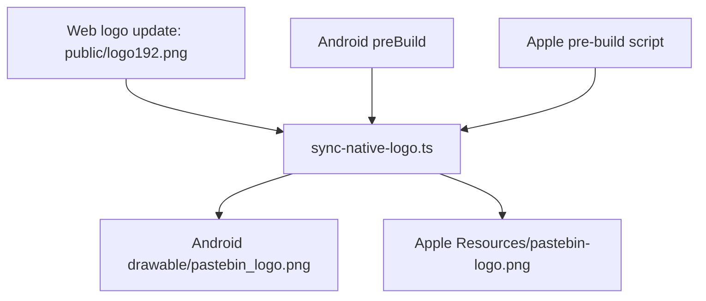

# Native Logo Sync Automation Design

This design makes web logo assets the source of truth and automatically mirrors them into native app resources.

## Problem
- Native logo files can drift when web branding assets are updated.
- Current behavior relies on manual copying and is error-prone.

## Design
- Canonical logo source: `public/logo192.png`.
- Add script `scripts/sync-native-logo.ts` to copy source to both native destinations.
- Add build hooks:
  - Android: Gradle `preBuild` depends on `syncWebLogoForNative` copy task.
  - Apple: Xcode pre-build script copies source to app resources.

## Notes
- This is additive and backward compatible with current UI wiring.
- Existing Android/Apple references (`pastebin_logo`, `pastebin-logo`) remain unchanged.

## Risks
- If source logo is missing, build scripts should fail fast with a clear error.
- Path assumptions depend on current repository layout.

## Validation
- Execute root sync command and native builds to verify copy behavior and no regressions.
