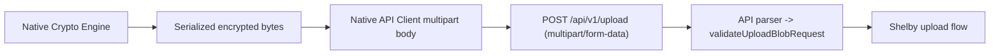

# Native Multipart Upload Adoption Design

## Summary
Adopt multipart uploads in native clients so encrypted payload bytes are transmitted as binary form parts instead of JSON byte arrays.

## Existing Behavior
- iOS `URLSessionAPIClient.uploadEncryptedBlob(...)`:
  - Sends `application/json` body with `{ data: [UInt8], filename: String }`.
- Android `HttpApiClient.uploadEncryptedBlob(...)`:
  - Sends `application/json` body with byte `JSONArray`.

## Target Behavior
- Both clients send:
  - `POST /api/v1/upload`
  - `Content-Type: multipart/form-data; boundary=...`
  - `file` form part containing encrypted payload bytes
  - `filename` text field mirroring current behavior

## Data Flow

## Apple Design
- Add multipart body builder in `URLSessionAPIClient`:
  - Generates boundary.
  - Appends `file` binary part + `filename` text part.
  - Sanitizes filename for multipart headers.
- Keep generic JSON request path for health/download.

## Android Design
- Add multipart body builder helper in `HttpApiClient.kt`.
- Add upload request path that writes raw multipart bytes to `HttpURLConnection` output stream.
- Keep existing JSON request helper for health/download.

## Compatibility
- Fully backward compatible with current backend endpoint behavior.
- No changes to response payload schemas.

## Validation
- Apple unit test captures outgoing request and asserts multipart content type/body markers.
- Android unit test verifies multipart body structure and filename field.
