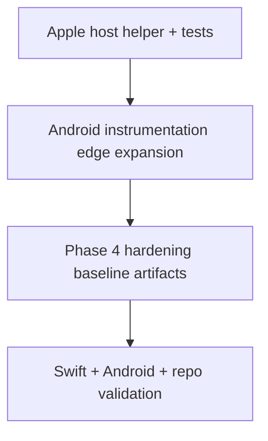

# Native Next 123 Design

This document defines the design for the requested `1,2,3` implementation sequence.

## 1) Apple Host/Shell Integration Coverage

### Problem
Current host tests cover only one history-to-decrypt handoff path. Settings-apply rebuild behavior is implemented in app wiring but not tested through a shared helper contract.

### Design
- Introduce a small pure helper in `AppShellDemo` for runtime settings apply semantics:
  - stores API base URL string and rebuild token.
  - apply operation returns updated URL and incremented rebuild token.
- Reuse helper in `DemoRootContainerView` to keep behavior identical while making it testable.
- Extend `AppShellDemoTests`:
  - verify settings apply updates URL and increments token.
  - verify repeated history open handoffs keep decrypt tab active and always prefill latest URL.

## 2) Android Instrumentation Expansion (Second Pass)

### Coverage Targets
- Upload picker edge behavior:
  - ACTION_OPEN_DOCUMENT cancel does not create selected file state and submit remains disabled.
  - invalid picker URI leads to user-visible read error.
- Decrypt recreation behavior:
  - decrypt draft inputs do not survive activity recreation.
- History sync failure/retry:
  - malformed fixture sync shows error.
  - valid fixture after reconfiguration succeeds and renders success summary.

### Design
- Add deterministic test tags for Upload file-picker trigger.
- Add a new instrumentation suite for upload/decrypt picker+recreation edges.
- Extend existing history coverage suite for failure/retry workflow.

## 3) Phase 4 Hardening Baseline

### Goal
Ship executable hardening artifacts instead of only narrative TODOs.

### Design
- Add a dedicated hardening design doc/checklist:
  - accessibility (VoiceOver/TalkBack, dynamic type)
  - privacy analytics payload denylist/allowlist checks
  - performance profiling runbook for large-file flows
- Add a paired plan document and README pointers so engineers can run the checklist and profiling commands consistently.

## Validation Strategy
- Apple: `swift test`
- Android: `connectedDebugAndroidTest` plus unit/compile tasks
- Repo: lint/typecheck/test/build with `bun`

## Flow

