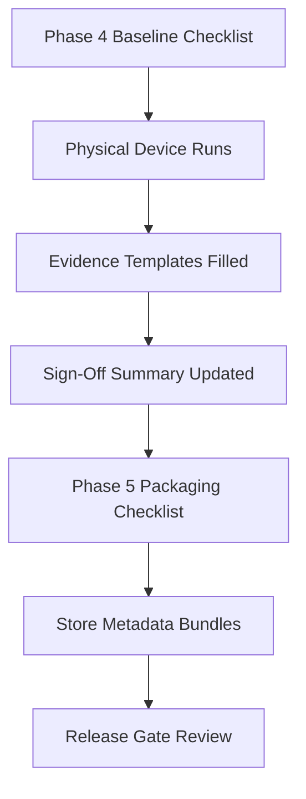

# Native Phase 4 Sign-Off + Phase 5 Store Readiness Design

This document defines how manual hardening evidence and release packaging artifacts are produced and stored.

## Problem
Current hardening results cover emulator/simulator automation and static audits, but final sign-off still requires:
- physical-device accessibility validation (VoiceOver/TalkBack),
- profiler captures for large-file scenarios,
- explicit store submission checklists and metadata bundles.

## Design Goals
- Standardize evidence capture across Apple and Android.
- Ensure every release gate has owner/date/evidence linkage.
- Keep artifacts easy to diff and review in pull requests.

## Non-Goals
- Automating App Store Connect or Play Console uploads.
- Storing credentials, signing keys, or private policy documents.

## Artifact Model



## Repository Layout

```text
native/
  qa/
    phase4/
      README.md
      device-matrix.md
      accessibility-checklist.md
      profiling-metrics.md
      privacy-audit-evidence.md
  release/
    README.md
    release-gate-checklist.md
    apple/
      app-store-connect-metadata.md
      privacy-nutrition-label-template.md
      release-checklist.md
    android/
      play-console-metadata.md
      data-safety-template.md
      release-checklist.md
```

## Execution Flow
1. Use `native/qa/phase4/README.md` to run the device pass and profiler capture.
2. Fill per-device evidence in `device-matrix.md`, `accessibility-checklist.md`, and `profiling-metrics.md`.
3. Record privacy scan evidence in `privacy-audit-evidence.md`.
4. Complete store metadata templates under `native/release/apple/` and `native/release/android/`.
5. Mark consolidated readiness in `native/release/release-gate-checklist.md`.

## Quality Gates
- Phase 4 cannot be signed off with empty evidence rows.
- Phase 5 cannot be marked ready unless Apple + Android platform checklists are both complete.
- Any failed gate must include remediation owner and target date.
