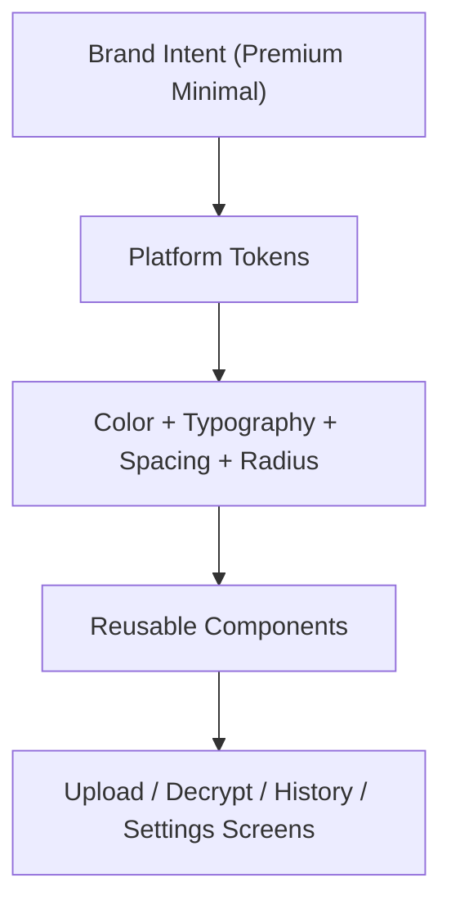

# Native Premium Minimal Design System

This design defines a premium minimal style system for native Apple and Android clients.

## Visual Direction
- Calm, neutral palette with a restrained accent color.
- Soft rounded geometry and low-noise surfaces.
- High-contrast text hierarchy with modest typographic emphasis.
- Reduced visual clutter via grouped cards and deliberate spacing.

## Tradeoffs and Decisions
1. Keep platform-native controls:
   - Pros: accessibility and platform familiarity remain strong.
   - Cons: exact pixel parity across platforms is not guaranteed.
2. Use tokenized styling instead of custom asset-heavy skins:
   - Pros: faster rollout and safer maintenance.
   - Cons: less bespoke than a full illustration-heavy brand layer.
3. Preserve existing strings/test tags:
   - Pros: no UX copy drift and no instrumentation churn.
   - Cons: some labels remain utilitarian during this pass.

## Token Model

## Apple Implementation
- Add AppShellDemo-level theme tokens and reusable modifiers:
  - gradient backdrop
  - elevated card surface
  - primary button styling
  - form-screen styling hooks
- Apply to host shell tabs and settings sheet, then flow views.

## Android Implementation
- Add Compose theme definition:
  - custom `ColorScheme`
  - shape system for cards/buttons/fields
  - typography mapping for headers/body/captions
- Add reusable premium components:
  - screen scaffold background
  - section card surface
  - status chip
  - primary button wrapper
- Apply to app shell and all flow screens.

## Accessibility Considerations
- Maintain readable contrast and large touch targets.
- Keep semantic labels and status text unchanged.
- Avoid decorative-only controls that hide critical actions.
