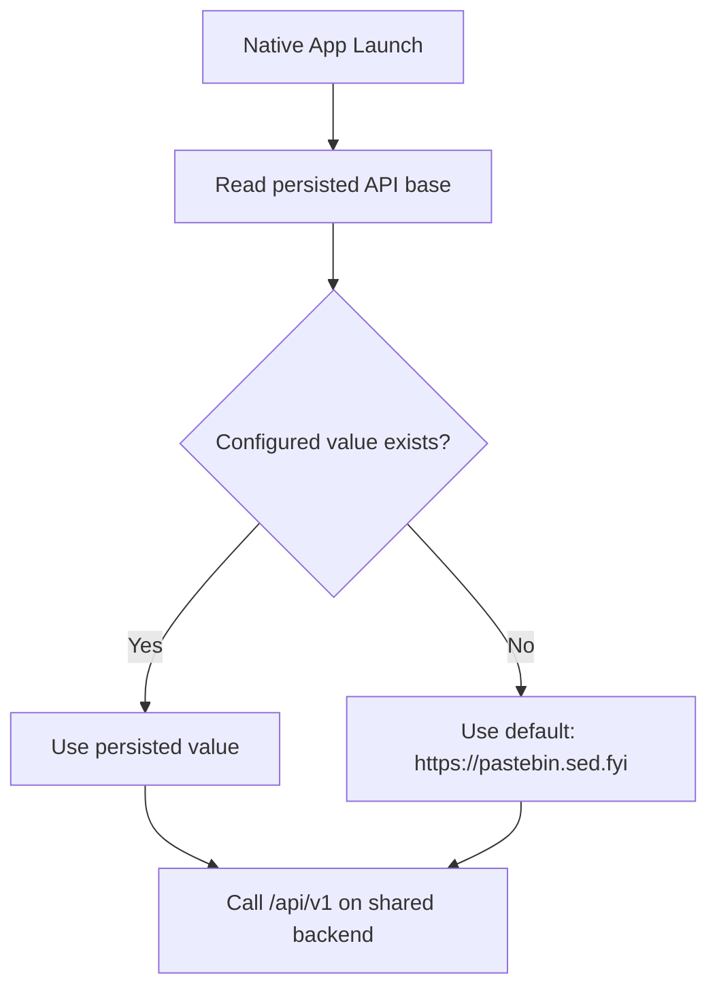

# Native Shared Backend Default Design

This design ensures native clients use the same backend default as the website.

## Problem
Native apps currently default to local development endpoints (`127.0.0.1` / `10.0.2.2`). Users must manually configure runtime settings to use the same backend as the website.

## Decision
Set native default API base to website production origin:
- `https://pastebin.sed.fyi`

Retain runtime preset/settings UIs for explicit local/staging override during development.

## Platform Changes
- Android:
  - Default API base constant in app host flow set to production origin.
  - Settings presets unchanged (`Local`, `Staging`, `Production`), but default selected value is production.
- Apple:
  - `@AppStorage` default API base set to production origin.
  - `HostRuntimeSettingsState.resolvedAPIBaseURL` fallback set to production origin.
  - `DemoAppFactory` default `apiBaseURL` set to production origin.
  - Demo settings preset list unchanged for optional local/staging override.

## Tradeoffs
- Pros:
  - No manual setup required for production/backend parity with website.
  - Reduces onboarding and configuration mistakes.
- Cons:
  - Local API testing now requires selecting the `Local` preset manually.

## Follow-up
If environment-specific builds are needed later, add build-time flavor/scheme injection for default API base while keeping production as release default.
