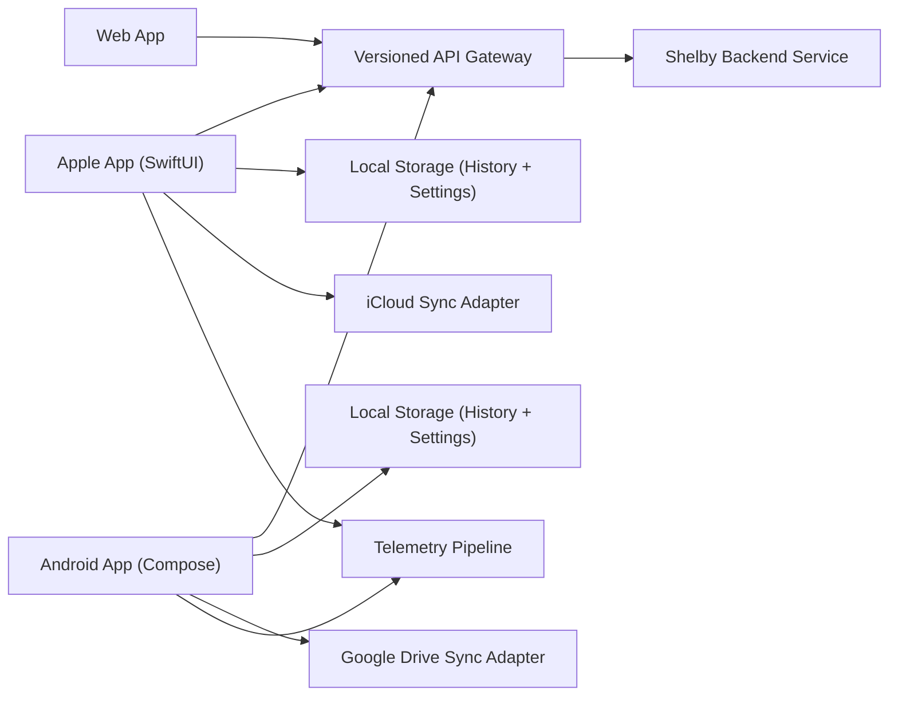
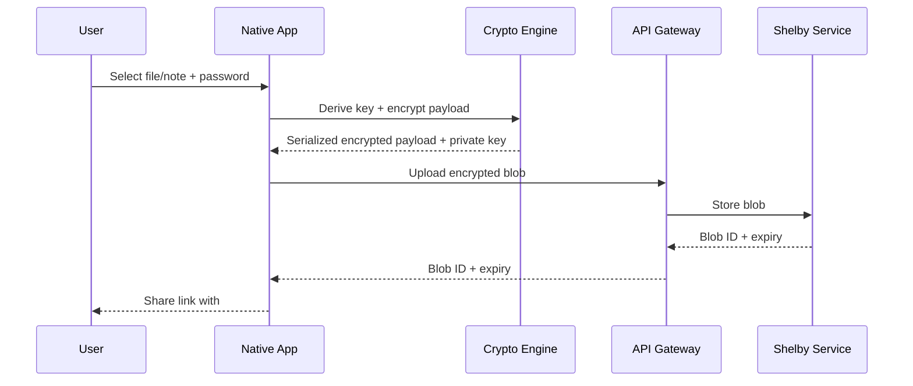
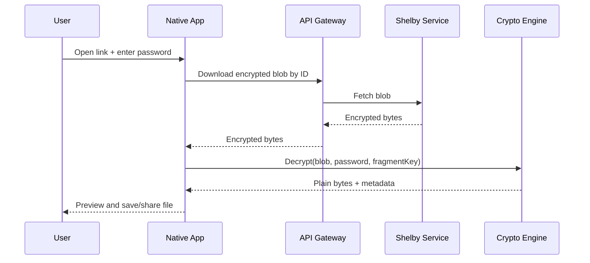
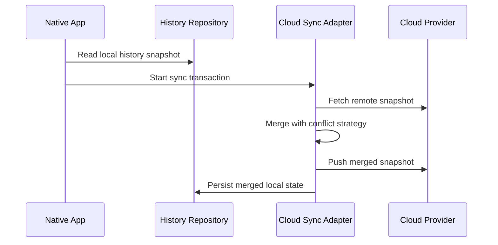

# Native Swift + Kotlin Architecture

## Purpose
This document defines the target architecture for fully native Apple apps (Swift for iOS, iPadOS, macOS) and a fully native Android app (Kotlin) that match current web app functionality.

## Design Goals
- Preserve zero-knowledge behavior from the web app.
- Keep crypto behavior byte-compatible across web, Swift, and Kotlin.
- Keep platform UI fully native.
- Minimize duplicated business logic by sharing protocol/spec artifacts.
- Support staged rollout and safe migration from existing web and React Native code.

## Confirmed Product Decisions (2026-02-07)
- Native crypto per platform (Swift + Kotlin), no shared Rust bridge in v1.
- Versioned REST API for native clients.
- Core-first mobile v1 scope, then docs/onboarding parity.
- Cloud sync included in v1 (iCloud + Google Drive).
- Fixed server-controlled expiration policy.
- 100MB file limit retained.
- Preview in v1 includes text, image, PDF, and media.
- Password policy slightly relaxed for mobile UX (with minimum security floor).
- Apple and Android built in parallel; macOS deferred to post-stabilization.
- Rich analytics enabled with strict privacy controls.
- Windows deferred until post-GA.

## Non-Goals (Initial Release)
- Account system.
- Multi-user collaboration.
- Mandatory cloud sync.
- End-to-end redesign of backend storage provider.

## High-Level Architecture

## Logical Components

### 1) Client Core (per platform)
- `CryptoEngine`
- `NetworkingClient`
- `HistoryRepository`
- `DeepLinkParser`
- `PasswordPolicy`

### 2) Feature Modules
- Upload Feature:
  - File picker or note editor.
  - Password + metadata encryption controls.
  - Progress and result link.
- View Feature:
  - Parse link and fragment key.
  - Decrypt and download/export.
  - Text/image/PDF/media preview for safe types.
- History Feature:
  - List, remove, clear, expiry state.

### 3) Backend Integration
- Upload endpoint.
- Download endpoint.
- Health endpoint.
- Explicit API versioning (`/v1/...`) for native stability.

## Crypto Compatibility Contract

### Algorithms and Parameters
- ML-KEM-768 for encapsulation.
- AES-256-GCM for payload and optional metadata encryption.
- Argon2id key derivation:
  - Iterations: 4
  - Memory: 256MB
  - Parallelism: 4
  - Salt: 32 bytes

### Password Policy Profile (Mobile)
- Mobile policy may be less strict than current web policy to reduce user friction.
- Required security floor:
  - Minimum length of at least 12.
  - Mixed character-set requirements retained.
  - Common-password and obvious-sequence rejection retained.
- Any policy deltas vs web must be explicitly documented in conformance docs.

### Key and Link Rules
- URL fragment carries base64url private key.
- Fragment must never be sent to server.
- Decrypt requires both password and private key fragment.

### Serialized Payload Format (v1)
- Byte layout:
  - `version(1)`
  - `flags(1)` (`bit0 = metadataEncrypted`)
  - `saltLen(2)` + `salt`
  - `kyberCiphertextLen(2)` + `kyberCiphertext`
  - `aesCiphertextLen(4)` + `aesCiphertext`
  - `metadataLen(4)` + `metadataBytes`

### File ID Validation
- Client-side validation should match server expectations:
  - Route-level pattern validation before network call.

## Platform Architecture

### Apple (Swift)
- UI: SwiftUI.
- Concurrency: async/await + actors for stateful services.
- Local storage:
  - History in Core Data or SQLite wrapper.
  - Small settings in `UserDefaults`.
- Secure material:
  - Keychain for optional future secrets.
  - In-memory zeroization helpers for ephemeral keys.
- App targets:
  - iOS + iPadOS universal.
  - macOS is deferred to post-GA and will reuse core modules.

### Android (Kotlin)
- UI: Jetpack Compose.
- Architecture: clean modular + MVVM.
- Concurrency: Kotlin coroutines + Flow.
- Local storage:
  - Room for history.
  - DataStore for preferences.
- Secure material:
  - Android Keystore integration where persistent secrets are needed.
  - In-memory clearing for ephemeral key material.

## Request Flows

### Upload Flow

### Decrypt Flow

### Cloud Sync Flow (v1)

## Parity Checklist (Must-Have)
- File upload with size checks.
- Note creation mode.
- Password validation and generation.
- Metadata encryption toggle.
- Decrypt/download by link.
- Text/image/PDF/media preview with size limits.
- Local history list and management.
- Cloud history sync across devices.
- Error states and progress staging.
- Theme handling and accessibility support.

## QA and Compliance Architecture
- Shared conformance test vectors committed in repo.
  - Source artifact: `shared/crypto/conformanceVectors.ts`
- CI gates:
  - Swift unit and UI tests.
  - Kotlin unit and instrumentation tests.
  - Cross-platform payload compatibility tests.
- Security checks:
  - No secrets in logs.
  - Key fragment excluded from telemetry.
  - Input validation parity with server-side checks.
- Privacy checks:
  - Analytics events reviewed against allowlisted schema.
  - No plaintext content, password, or private-key-fragment telemetry.

## Migration Plan from Existing Mobile Folder
- Keep existing `mobile/` React Native code as reference only during transition.
- Implement native apps in new directories:
  - `native/apple/`
  - `native/android/`
- Add `native/macos/` only after iOS/iPadOS stabilization.
- Decommission React Native build only after parity and store release success.

## Windows Stretch Design
- Native option: WinUI 3 + .NET 8 client.
- Reuse:
  - Same API contract.
  - Same crypto serialization spec and vectors.
- Explicitly deferred until after iOS+Android GA and stabilization.
