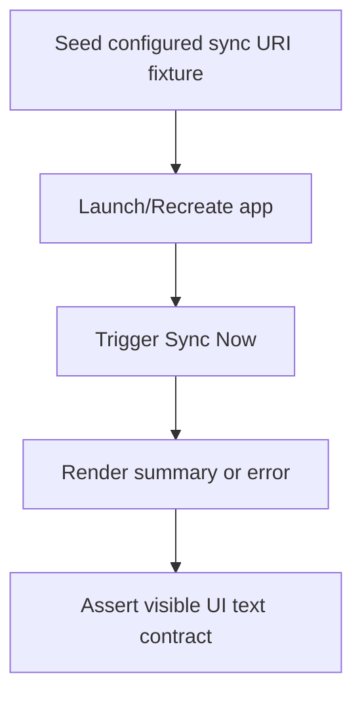

# Native Sync Edge-Case Coverage Design

This design defines deterministic test paths for additional sync edge cases on Android and Apple.

## Android Instrumentation

### Re-selection path
- Simulate Drive file re-selection by writing a new configured URI into `secure_pastebin_cloud_sync_v1`.
- Force activity recreation so `NativeFlowApp` rebuilds `HistoryCloudSyncCoordinator` with the updated URI.
- Assert second sync reflects the new remote payload and conflict summary.

### Failure path
- Seed a configured sync URI with malformed JSON payload.
- Trigger `Sync Now` and assert visible error text from sync failure handling.

## Apple UI Messaging Contract
- Extract cloud-sync message/title selection logic into testable helper functions used directly by `HistoryFlowView`.
- Validate mappings for:
  - `.idle`
  - `.syncing`
  - `.success(summary:)`
  - `.failure(message:)`

## Determinism
- Prefer local app-files fixtures and shared-preference setup for Android tests.
- Avoid external picker intents in instrumentation by simulating post-picker configuration results.
- Keep Apple tests pure and deterministic by validating message mapping helpers directly.

## Flow

