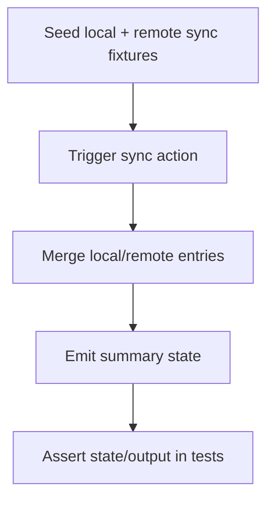

# Native Sync Test Coverage Expansion Design

This design adds deterministic test coverage for cloud sync UI/state behavior.

## Apple: ViewModel State Transitions
- Target: `HistoryFlowViewModel.syncCloud()` in `FeatureHistory`.
- Validate transitions:
  - no coordinator -> `.failure("Cloud sync is not configured.")`
  - successful coordinator -> `.success(summary: ...)`
  - failing coordinator -> `.failure(message: ...)`
- Use in-memory `HistoryStore` plus custom cloud adapters implementing `HistoryCloudSyncAdapter`.

## Android: Drive Sync Happy Path Instrumentation
- Target: History tab cloud-sync controls in `MainActivity`.
- Use app-internal JSON fixture file URI stored in cloud-sync shared preferences.
- Validate:
  - `Sync Now` executes and renders success summary text
  - conflict scenario renders summary including non-zero conflict count

## Determinism Notes
- Use explicit local/shared preference setup and cleanup per test.
- Avoid external picker/intent flows for these tests; inject configured URI directly via app preferences.
- Assert stable user-visible text output from summary formatter.

## Flow

