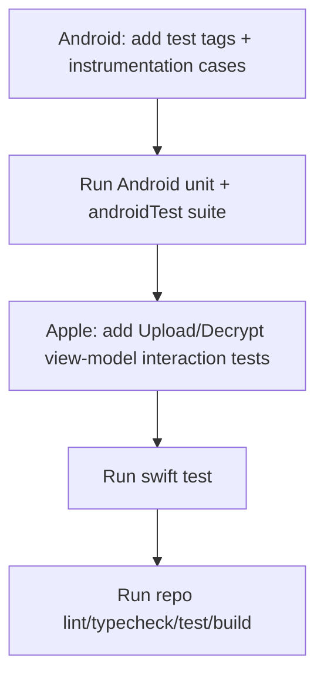

# Native UI Coverage Expansion (Round 3) Design

This design adds the next parity-hardening test layer in two ordered sections.

## Section 1: Android Instrumentation Expansion

### Coverage Additions
- Upload edge behavior:
  - File mode without selected file keeps upload action disabled.
  - Note-mode form state is cleared after activity recreation (security-oriented transient input behavior).
- Decrypt error edges:
  - Invalid share URL shows deterministic validation error.
  - Missing key fragment shows deterministic validation error.
- History/device-state behavior:
  - Configured cloud-sync state remains configured after recreation (`Sync Now` / `Change File` still visible).

### Determinism Strategy
- Use explicit test tags for upload/decrypt controls to avoid label-lookup ambiguity.
- Use storage-backed fixture setup for configured history cloud-sync state.
- Assert stable user-visible strings that come from deterministic local feature errors.

## Section 2: Apple Interaction-Level UI Coverage

### Coverage Additions
- Upload view-model interactions:
  - `canUpload` gate behavior across input modes.
  - file-mode upload action with no selected file emits expected validation message.
  - successful note upload updates share URL and exits uploading state.
- Decrypt view-model interactions:
  - `prefillShareURL` updates field and clears prior error.
  - `startSaveAs` without decrypted payload emits expected message.
  - decrypt action with invalid URL emits deterministic validation error and exits busy state.
  - decrypt action with missing key fragment emits deterministic validation error.

### Determinism Strategy
- Use fake API/crypto collaborators already used in feature tests.
- Poll bounded state transitions for async `Task` completion before asserting.

## Flow

