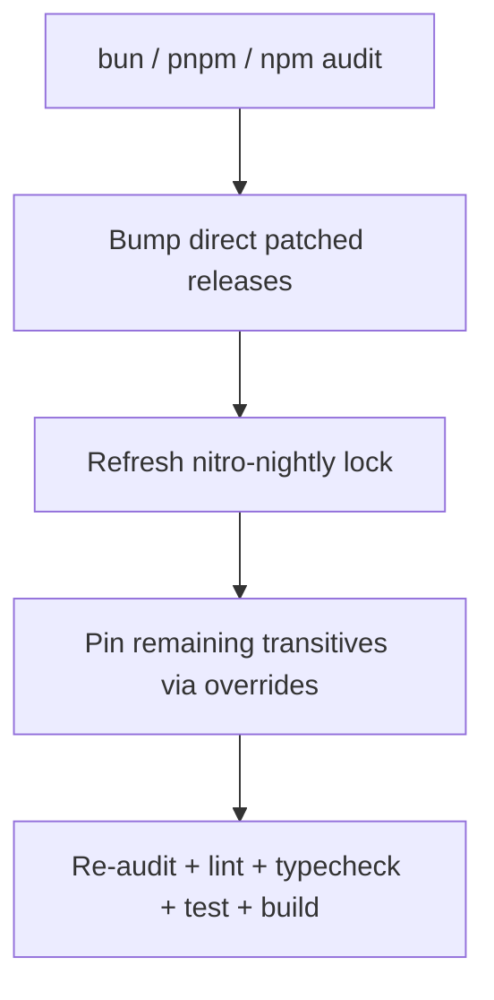

# Design: pnpm / bun Audit Dependency Fixes

This document describes how SecuPaste clears current npm/pnpm/bun audit findings.

## Problem

`npm audit` / `pnpm audit` / `bun audit` against the web lockfiles reported 20 issues, including critical findings in `vitest`, `seroval`, and `shell-quote`, plus high-severity issues in `h3`, `undici`, `vite`, `ws`, `js-yaml`, `postcss`, `rollup`, `nanoid`, and `picomatch`.

Most findings are transitive. Direct packages that must move:

- `@tanstack/react-start` 1.157.18 → patched 1.168.x (pulls `@tanstack/start-server-core` ≥ 1.167.30)
- `vite` 7.3.1 → 7.3.6 (Vite 7 patches without a Vite 8 major)
- `vitest` 4.0.18 → 4.1.x
- `nitro` (`nitro-nightly@latest`) lockfile was from 2026-01-31 and still pulled vulnerable `h3` 2.0.1-rc.11 / `srvx` 0.10.1 / `undici` 7.19.2. Bun kept that pin on a normal `bun install`, so `nitro` is now an explicit nightly: `3.0.1-20260826-135133-65a4e394`.

## Approach

### Direct upgrades

| Package | From | To | Why |
| --- | --- | --- | --- |
| `@tanstack/react-start` | 1.157.18 | ^1.168.49 | GHSA-9m65-766c-r333 + seroval |
| `@tanstack/react-router` | 1.157.18 | ^1.170.32 | Matches Start 1.168.49 |
| `@tanstack/router-plugin` | 1.157.18 | ^1.168.35 | Matches Start |
| `@tanstack/react-router-devtools` | 1.157.18 | ^1.167.1 | Matches router |
| `@tanstack/react-router-ssr-query` | 1.157.18 | ^1.167.1 | Keep family current |
| `vite` | 7.3.1 | ^7.3.6 | Dev-server path traversal / fs.deny |
| `vitest` | 4.0.18 | ^4.1.11 | UI server arbitrary file read/exec |
| `@vitejs/plugin-react` | 5.1.2 | ^5.2.0 | Stay on Vite 7-compatible 5.x |

### Chosen non-majors

Vite 8, Vitest 5, js-yaml 5, Babel 8, nanoid 6, and undici 8 all have patched releases, but they are major or breaking. This change stays on the patched current major for each.

### Overrides

`package.json` `overrides` (npm/bun) and `pnpm.overrides` pin remaining transitives:

- `h3` 2.0.1-rc.29
- `srvx` 0.12.7
- `undici` 7.29.0
- `ws` 8.21.3
- `seroval` 1.6.4
- `js-yaml` 4.3.1
- `launch-editor` 2.14.1
- `nanoid` 3.3.18
- `picomatch` 4.0.7 and `picomatch@2` 2.3.2
- `postcss` 8.5.26
- `rollup` 4.63.0
- `shell-quote` 1.10.0
- `@babel/core` 7.29.7

### Compatibility risk

TanStack Start 1.157 → 1.168 and a seven-month `nitro-nightly` refresh can change server-entry or Vite plugin APIs. The app currently uses:

- `createStartHandler` / `defaultStreamHandler` / `defineHandlerCallback` from `@tanstack/react-start/server`
- `createServerEntry` from `@tanstack/react-start/server-entry`
- `createServerFn` in `src/server/shelby.ts`
- `nitro()` from `nitro/vite`

If those exports move, adapt `src/server.ts` and `vite.config.ts` without changing API v1 behavior.

TanStack Start 1.168 `defaultStreamHandler` can return either a `Response` or `{ response, serverSsrCleanup }`. `src/server.ts` copies security headers onto whichever shape is returned so stream cleanup is not dropped.

`createServerFn().inputValidator()` is deprecated; use `.validator()`.

## Verification

1. `bun audit` and `npm audit` / `pnpm audit` report zero remaining issues, or only explicitly accepted residual risks.
2. `bun run lint`, `bun run typecheck`, `bun test`, `bun run build` pass.
3. CI includes an audit step so the lockfiles cannot silently regress.
