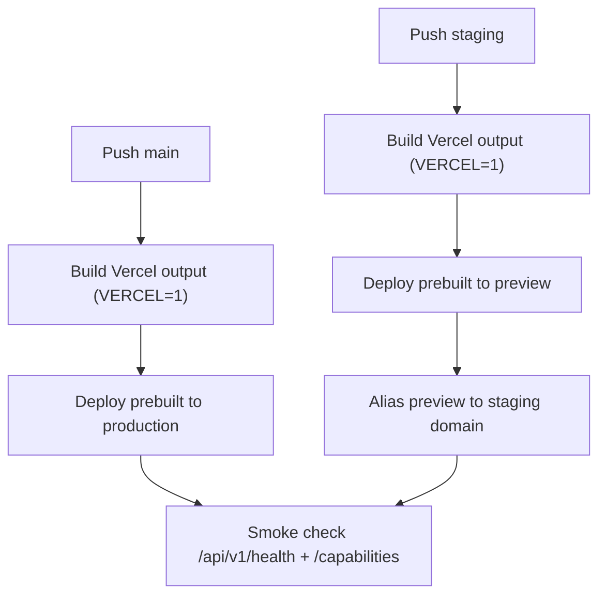

# Shared Backend Deployment And Native Logo Design

This design adds deployment controls for backend parity and integrates Pastebin branding in native clients.

## Problem
- Production returns `404` for `/api/v1/*` despite local Vercel output serving those endpoints.
- Staging hostname (`staging.pastebin.sed.fyi`) is unresolved.
- Native apps currently lack visible Pastebin logo branding.

## Decisions
1. Deployment
   - Add explicit Vercel deployment workflows:
     - production workflow on `main`
     - staging workflow on `staging`
   - Build prebuilt output with `VERCEL=1 bun run build`.
   - Deploy with `vercel deploy --prebuilt`.
   - Staging workflow applies alias/domain using `vercel alias set`.
2. Backend verification
   - Keep scheduled/manual smoke checks against production + staging.
   - Deployment workflows are required prerequisites for smoke checks to pass.
3. Branding
   - Android:
     - add logo PNG resource
     - render logo in app shell header
     - set launcher icon fields to logo resource
   - Apple:
     - add logo PNG under app source bundle resources
     - render logo in root container header

## Required Secrets
- `VERCEL_TOKEN`
- `VERCEL_ORG_ID`
- `VERCEL_PROJECT_ID`
- `VERCEL_STAGING_ALIAS` (example: `staging.pastebin.sed.fyi`)

## Risks
- Without valid secrets, deployment workflows will not execute successfully.
- Without DNS records for staging alias, staging reachability remains unresolved externally.

## Validation
- Local build/test suite for web + native.
- Smoke check script to confirm live endpoint parity post-deploy.
