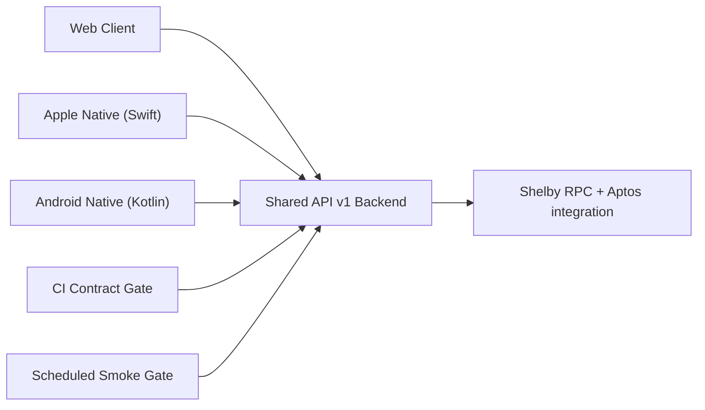

# Shared Backend Risk Audit And Hardening Design

This design defines the architecture checks, risk model, and mitigation strategy for running web + native clients against one shared backend.

## Architecture
- Shared backend API surface: `/api/v1/*` from `src/server/apiV1.ts`.
- Clients:
  - Web app uses server functions and API v1 routes for stable native contract support.
  - Apple app uses `URLSessionAPIClient` in `native/apple/Sources/CoreNetworking/APIClient.swift`.
  - Android app uses `HttpApiClient` in `native/android/core/network/src/main/kotlin/com/securepastebin/core/network/ApiClient.kt`.
- Environments:
  - Production: `https://pastebin.sed.fyi`
  - Staging: `https://staging.pastebin.sed.fyi`
  - Local: `http://localhost:3000` (web), `http://127.0.0.1:3000` (Apple), `http://10.0.2.2:3000` (Android)

## API Changes (Additive)
1. `GET /api/v1/capabilities` response:
   - `apiVersion`
   - `maxUploadBytes`
   - `maxFilenameLength`
   - `rateLimitWindowMs`
   - `maxUploadsPerWindow`
   - `maxDownloadsPerWindow`
2. `X-Request-Id` response header on API v1 responses.
3. Client-emitted optional request headers:
   - `X-Client-Platform`
   - `X-Client-Version`
   - `X-Request-Id`

## Risk Severity Rubric
- `P0`: data loss, exploitable security break, service outage.
- `P1`: major functional failures impacting core user flows.
- `P2`: degraded performance/reliability/UX without full outage.
- `P3`: maintainability and observability gaps.

## Seed Risk Register
| ID | Risk | Severity | Detection | Mitigation |
| --- | --- | --- | --- | --- |
| R1 | JSON byte-array payload inflation near 100MB causes 413/timeouts | P1 | Capacity checks + smoke/build logs | Capabilities endpoint + documented limits + telemetry checks |
| R2 | Per-IP limits penalize shared mobile carrier NAT clients | P2 | Rate-limit behavior tests + incident logs | Observe via platform/version/request-id headers; plan distributed limiter follow-on |
| R3 | In-memory rate limiter is instance-local and inconsistent at scale | P1 | Multi-instance incident drift | Track as accepted architectural debt; escalate to shared-store limiter when scale increases |
| R4 | Transport mismatch: Android cleartext and Apple ATS too permissive/restrictive by env | P1 | Build-variant policy tests + manual env checks | Android debug/release network policy split, Apple ATS hardening |
| R5 | Missing normalized client metadata reduces incident triage quality | P2 | API log review | Standardize optional client headers across native clients |
| R6 | API spec/implementation drift over time | P1 | CI contract check + scheduled smoke | Add contract script + CI job + release checklist gate |

## Security And Transport Decisions
- Android:
  - `network_security_config` set at app level.
  - Debug allows cleartext only for local dev hosts.
  - Release denies cleartext globally.
- Apple:
  - Remove `NSAllowsArbitraryLoads`.
  - Keep `NSAllowsLocalNetworking` for local development.

## Observability Decisions
- Each native request carries platform/version/request-id for traceability.
- API responses always return `X-Request-Id` for client-to-server correlation.

## Continuous Gate Design
- PR gate:
  - Lint, typecheck, tests, API contract check.
- Scheduled/manual smoke gate:
  - Production + staging `health` and `capabilities`.
  - Schema/status and trace-header validation.

## Deferred Follow-Ups
- Evaluate streamed/binary upload format to reduce JSON overhead for large payloads.
- Move rate limiter to shared distributed storage (Redis/Upstash/etc.) before high-scale launch.
- Add API authn/authz model if backend shifts beyond current threat model.
